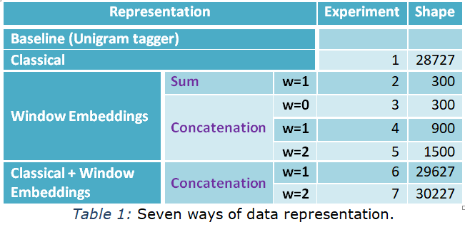
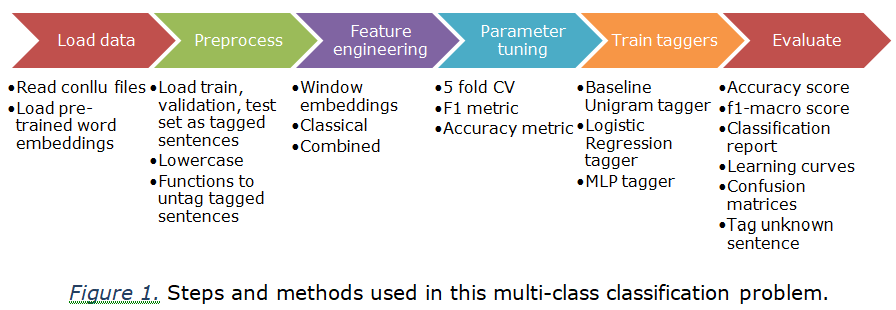
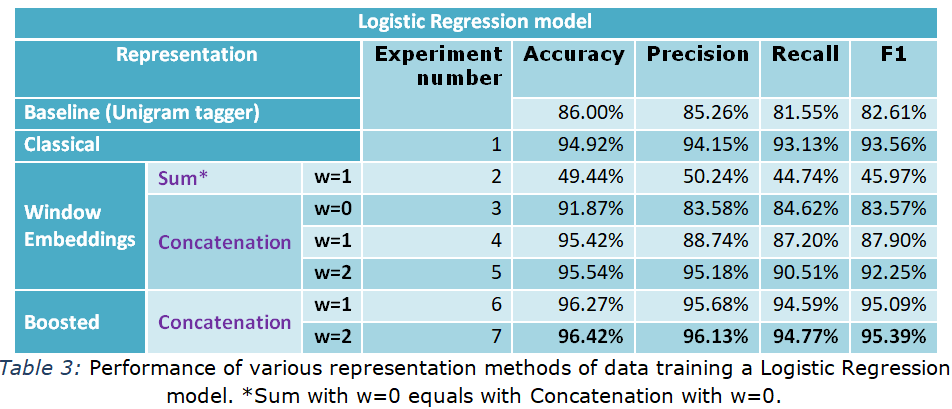
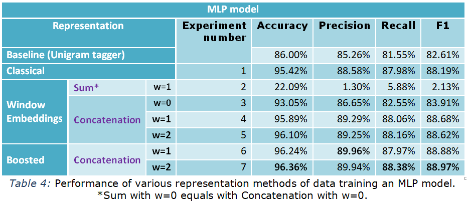

# Αn MLP Pos Tagger trained on UD treebank
The task of this work is to develop a part-of-speech (POS) tagger for the English language of the <a href="http://universaldependencies.org/">Universal Dependencies</a> treebanks, using an MLP operating on windows of words (<a href="https://eclass.aueb.gr/modules/document/file.php/INF210/slides_2018_19/nlp_slides_part03_text_classification_with_mlps.pdf">slides 38–39</a>). We consider only the words, sentences, and POS tags of the treebank (not the dependencies or
other
annotations). Because our manually annotated with POS tags corpus is
small, to
generate word features we use pre-trained word embeddings and finally find an overall best accuracy **96.42%**.

We approach the task of this work as a
multi-class
classification problem where every training example is the features
generated
per word and labels are the 17 different classes (pos tags). As
classifiers,
first we use a <b>Logistic Regression</b>
model and then an <b>MLP</b> model (fully
connected feed-forward neural network). Our
experiments involve <strong>7 different
representations</strong>
of data (shown in Table 1) compared also with an appropriate Baseline tagger.

So in this work we make 14 experiments in total (7 methods x 2 classifiers). A summarization of our methodology and inner-code working is shown in Figure 1.

## Experimental Results - Conclusions
We were very impressed reaching **96.42%** accuracy, while the state-of-the-art <a href="https://arxiv.org/pdf/1711.04903.pdf">Adversarial Bi-LSTM</a> model reaches **95.82%** trained on the UD English EWT Treebank. Even with the single window embeddings method with concatenation and window size=2, we reached 96.10% with our simple MLP implementation (not using an embedding and LSTM layer).

## Some final points:
- Window embeddings method is very fast due its reduced dimension shape (900 compared to 28727 of classical method) and has very good performance (in accuracy and f1-macro metrics). This is indicative of the very rich and strong information the word vectors carry.
- Increasing the window size, at least in LR model, gives a significant improvement to f1-macro score – a major factor for unbalanced sets.
- Summing of vectors in window embeddings method is a very bad option. Every learned morpho-syntactic feature seems to disappear!
- It is interesting that the same pre-trained word embeddings model trained with subword information gives worse results in our task.

## Acknowledgement
<a href="https://eclass.aueb.gr/courses/INF210/">Natural Language Processing</a> course is part of the MSc in Computer Science of the Department of Informatics, <a href="https://aueb.gr/en">Athens University of Economics and Business</a>. The course covers algorithms, models and systems that allow computers to process natural language texts and/or speech.
